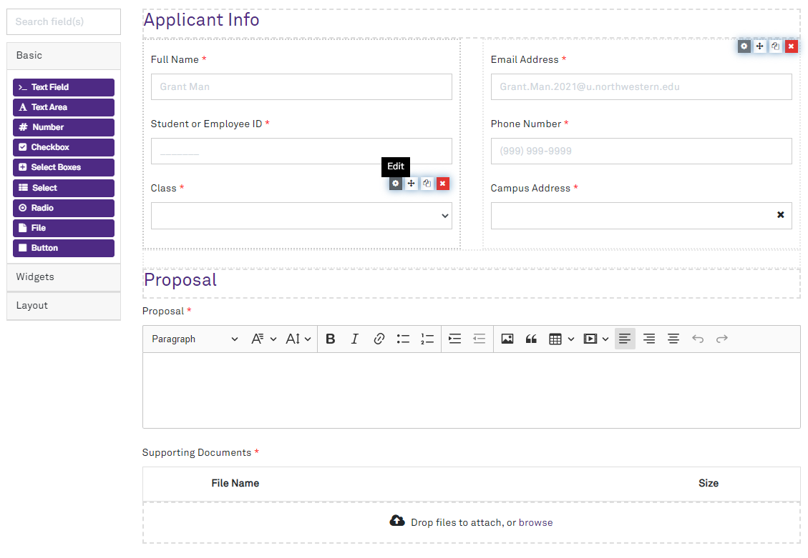

# Dynamic Forms for Laravel [](https://github.com/NIT-Administrative-Systems/dynamic-forms/actions/workflows/phpunit.yml) [](https://coveralls.io/github/NIT-Administrative-Systems/dynamic-forms?branch=develop) 
User-defined forms are a perennial problem for developers. 

Dynamic Forms for Laravel gives you an easy solution: a drag-and-drop builder, an easy way to display the forms, and back-end validation. 



## How does this work?
The front-end is powered by the open source [Form.io](https://github.com/formio/formio.js) JavaScript library. This is an awesome library: the builder is user-friendly, you can adjust what's offered, and add your own custom form fields. 

On the backend, it's as simple as calling `$request->validateDynamicForm()`. It behaves just like the [`validate`](https://laravel.com/docs/8.x/validation#quick-writing-the-validation-logic) method you're used to in Laravel. 

You **do not** need to use the Form.io SaaS platform. Your Laravel application is filling that role.

## Getting Started
**:heavy_exclamation_mark: This is in a pre-release state.**

```
composer require northwestern-sysdev/dynamic-forms
php artisan dynamic-forms:install
```

Further information about usage can be [found in the docs](https://nit-administrative-systems.github.io/dynamic-forms/).

## Contributing
If you'd like to contribute to the library, you are welcome to submit a pull request!

There is [a roadmap](https://github.com/NIT-Administrative-Systems/dynamic-forms/projects/1) under the projects tab, so if you're looking for ideas, those issues are a great place to start.
